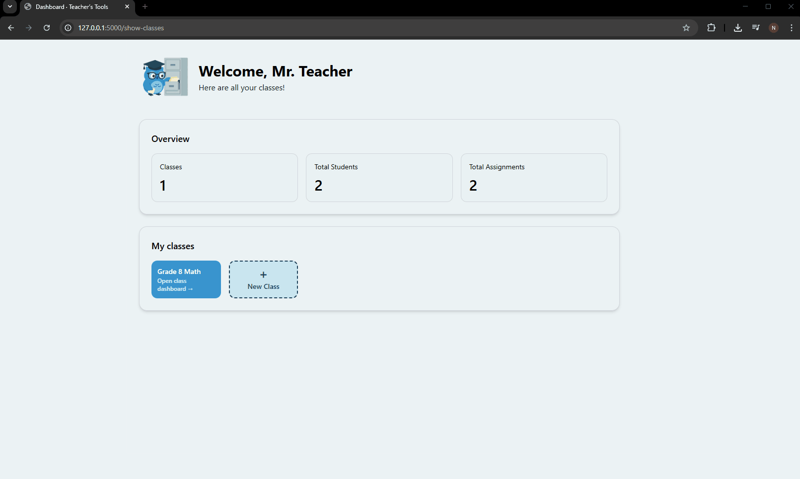
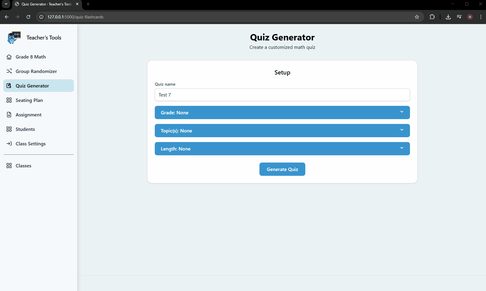
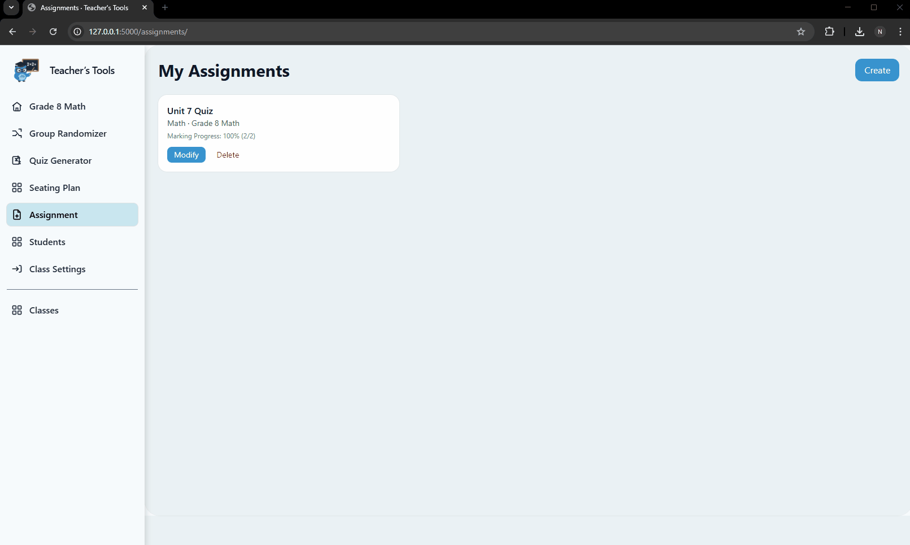

# teacher-tools-showcase
## Project Overview

This project was developed by a 5-person team as a course project.
Each team member owned distinct features.

The full codebase is hosted in a private GitLab repository and cannot be
shared publicly. This repository serves as a **portfolio showcase of my
individual contributions**, design decisions, and implementation work.

## My Contributions

### Frontend Architecture & Design System

I owned the frontend design and iteration cycle, including an early
refactor to stabilize and standardize the UI layer. Frontend implementation also used **Tailwind CSS** with selective use of
**Flowbite components** for standardized interactive elements
(e.g., dropdowns, modals).

- Designed the application’s visual system from scratch using **Tailwind CSS**
- Built reusable **Tailwind components and Jinja macros** that were adopted
  team-wide
- Refactored the frontend to enforce consistent layout, spacing, and component
  usage across all views
- Established frontend patterns that enabled parallel feature development
  without UI drift
  
### CI Integration & Quality Gates

I designed and implemented the **continuous integration (CI) stage**
of the project’s Jenkins pipeline.

- Implemented automated quality gates for every pull request:
  - Python linting (flake8)
  - Frontend linting (PostCSS, HTMLHint)
  - Backend test execution (pytest)
  - Coverage reporting (pycov)
- Configured the CI stage to **block merges on failure**
- Integrated CI checks into the team’s existing deployment workflow

### Dynamic Quiz Generation System

I designed and implemented a modular quiz generation system used to
produce grade-appropriate quizzes with exportable answer keys.

Key characteristics:
- **Data- and rule-driven architecture** supporting grades 1–8
- Multiple question generators implemented via a shared abstract interface
- Support for diverse question types:
  - arithmetic operations
  - fractions and decimals
  - order of operations
  - equations and probability
- Deterministic answer key generation
- Export to **DOCX** (student quiz + teacher answer key) and ZIP packaging

The system was integrated into the UI and **validated by stakeholders**
against functional requirements and test cases.

### Assignment Management & Persistence

I implemented an assignment management subsystem using **Flask** and
**MySQL**, focusing on correctness and scalability.

- Designed the relational data model for assignments, students, and classes
- Implemented bulk student seeding when creating new assignments
- Built grade aggregation logic with numerator/denominator tracking
- Implemented **upsert-style persistence** to safely handle partial updates
- Ensured correctness via transactional-style updates and defensive validation

The system supports editing, aggregation, deletion, and late-added students
without data corruption.

## Team Acknowledgement

This project was a collaborative team effort. Components not listed above
were designed and implemented by other team members.

This repository is a personal portfolio artifact and does not represent
the complete system.

